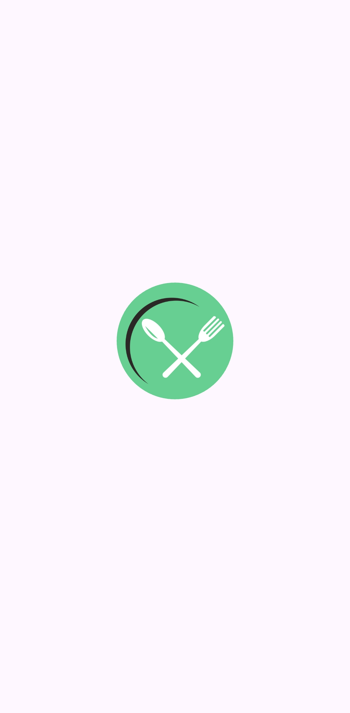
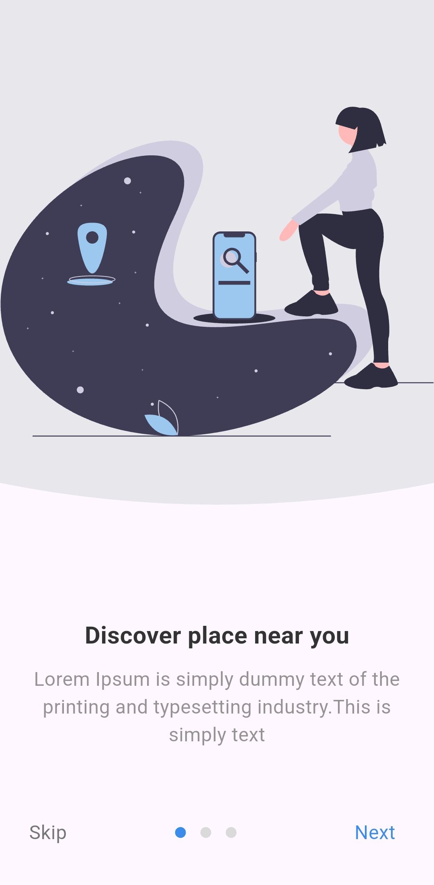
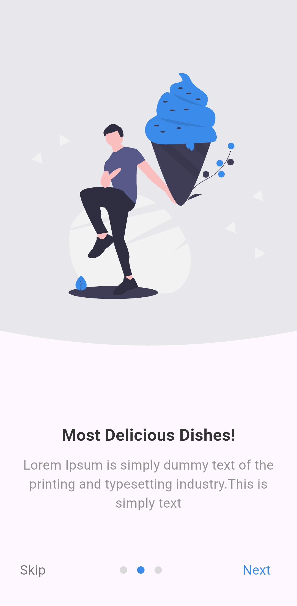
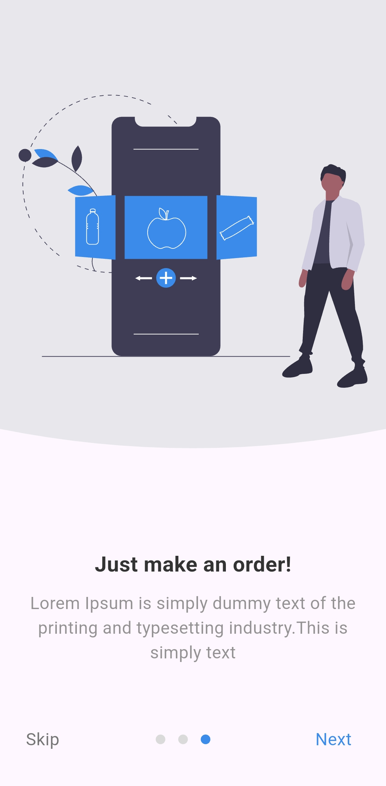
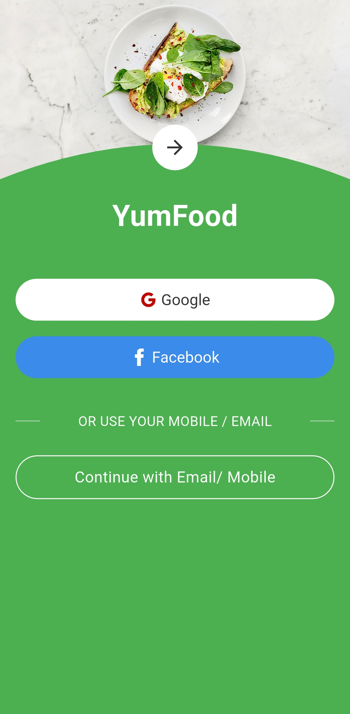
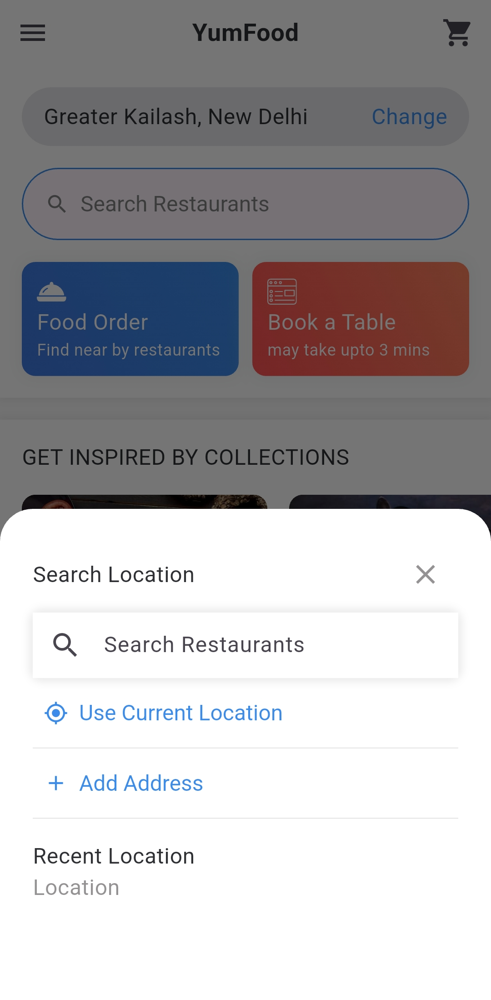
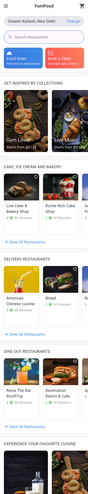
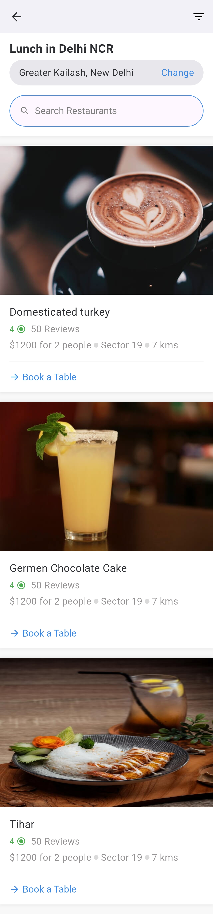

# Yum Food Flutter – UI Demo

A visually appealing Flutter demo app for a food delivery or restaurant platform.  
This is a **UI-only** project meant to showcase layout and design, without backend or dynamic data.

---

## 📱 Overview

The app includes UI elements commonly found in food-related applications, such as:

- Home screen with featured dishes
- Food categories
- Product details
- Cart preview layouts

---

## 🔍 Status

**Demo only** – No backend integration or working functionality.

---

## 📸 Screenshots

<table>
  <tr>
    <td></td>
    <td></td>
    <td></td>
    <td></td>
  </tr>
  <tr>
    <td></td>
    <td></td>
    <td></td>
    <td></td>
  </tr>
  <tr>
    <td></td>
    <td></td>
    <td></td>
    <td></td>
  </tr>
</table>

---

## 📝 Notes

- Built entirely with Flutter
- Clean, modular UI components
- Great starting point for any food or restaurant app

---

## ✍️ Created by

**Mohamed Ebrahim**
